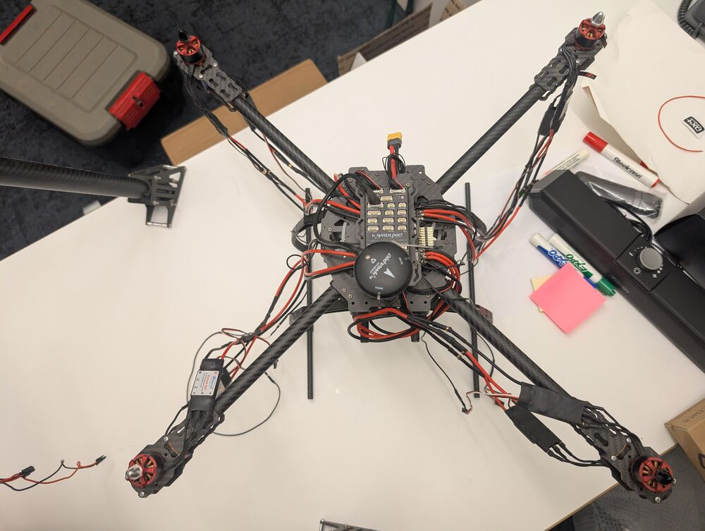

# Mini Me

## Description

The smaller copter that was delivered with the Nakoda drone has the same octocopter configuration. 

Originally called "Bride of Chucky", we're calling it "mini-me"

## Pixhawk4

### GPS
  [Holybro M8N](https://holybro.com/collections/dronecan-gps-module/products/dronecan-m8n-gps)
  
### RC Antenna
  [RX8R PRO](https://www.frsky-rc.com/product/rx8r-pro/)

### SiK Telemetryr Radio 
  [Holybro SiK V3](https://holybro.com/products/sik-telemetry-radio-v3)

### FPV Antenna

## Power Distribution Board (PDB)
  
  [Holybro PM07](https://holybro.com/products/pixhawk-4-power-module-pm07)

## Motors

Eight [DJI 2212/920KV](https://www.readytosky.com/e_productshow/?787-RS2212-920KV-CW&CCW-Brushless-Motor-787.html Brushless){target=_blank} motors

## Electronic Speed Controller (ESC)

8 x [Readytosky SimonK 30A ESC](https://www.readytosky.com/e_productshow/?297-Readytosky-Simonk-30A-Electronic-Speed-Controller-297.html){target=_blank}
