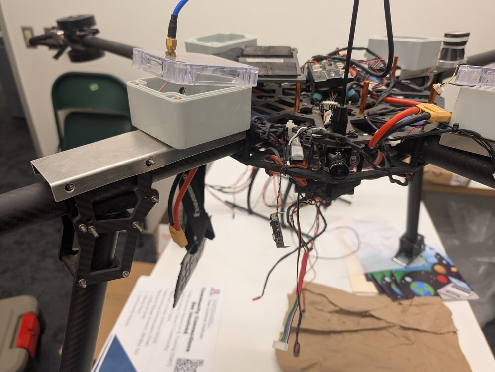

# Nakoda

## Description

Quad-copter with eight motors

## Pixhawk4

The drone operates with a Pixhawk4, the firmware is TBD, but is likely the [Ardupilot Copter](https://ardupilot.org/copter/index.html) quad with eight motors. 

The [Pixhawk4 PX4 Autopilot](https://docs.px4.io/main/en/) is an open industry standard autopilot. 

### Wiring Chart

[Pixhawk4 Wiring Chart Overview](https://docs.px4.io/main/en/assembly/quick_start_pixhawk4.html){target=_blank}

### GPS

Primary GPS is Single Pixhawk4 GPS on the main body, this GPS is also responsible for Integrated Compass, LED, Buzzer, and Safety Switch.

Currently, no RealTime Kinetics (RTK) GPS -- although there are options avaialble from [Holybro](https://holybro.com/search?type=product%2Carticle%2Cpage%2Ccollection&options[prefix]=last&q=RTK*){target=_blank}

### RC Antenna

### FPV Camera

The drone had a FPV camera which could be used with a heads-up display or with FatShark FPV goggles.

We are planning to remove the FPV camera during the repair and will determine whether it offers any kind of core functionality critical to Nakoda's operation.

Currently, we believe that the drone does not need a FPV camera to operate (within line-of-sight of a S107 licensed operator, autopilot using a [GCS MissionPlanner or QGround Control](planner.md))

## Power Distribution Board (PDB)

## Motors

Eight [U10ii KV100](https://store.tmotor.com/product/u10-2-u-efficiency.html){target=_blank} efficiency multirotors.

## Electronic Speed Controllers (ESCs)

8 x [ALPHA 60A 12S V1.2 FOC ESC](https://store.tmotor.com/product/alpha-60a-12s-esc.html?srsltid=AfmBOooouasZk1J114ujHXOl6Q00qO5cQeZWmUeZPT8CRre4Kc0x56FR){target=_blank}

##