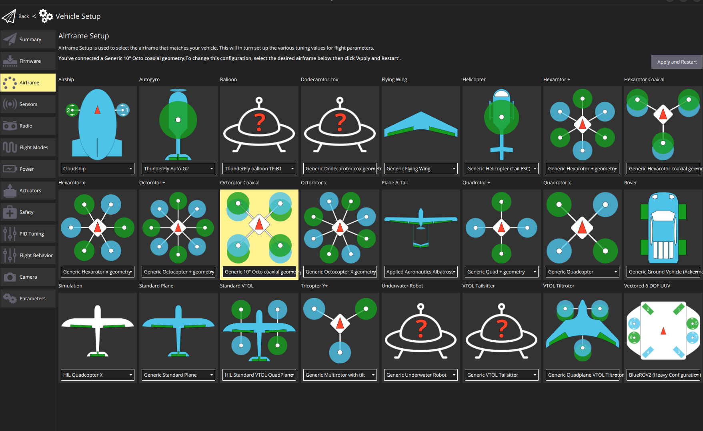
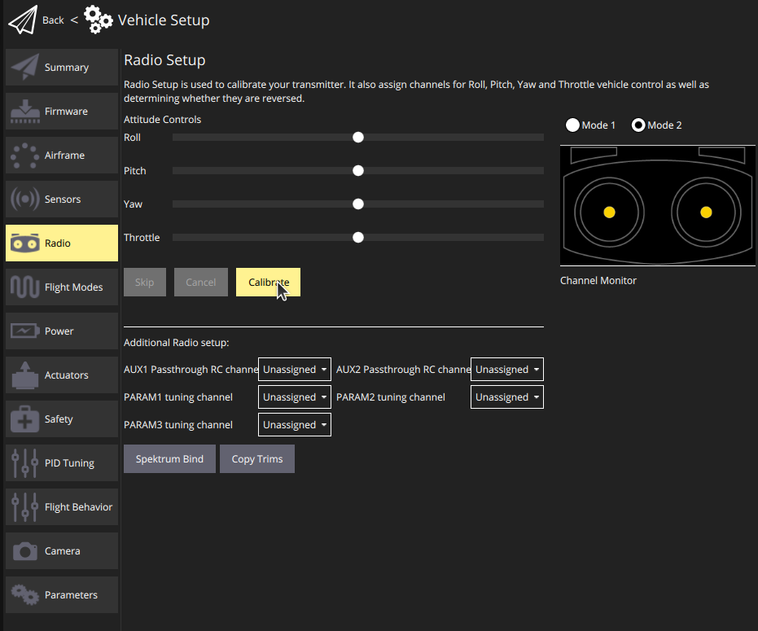
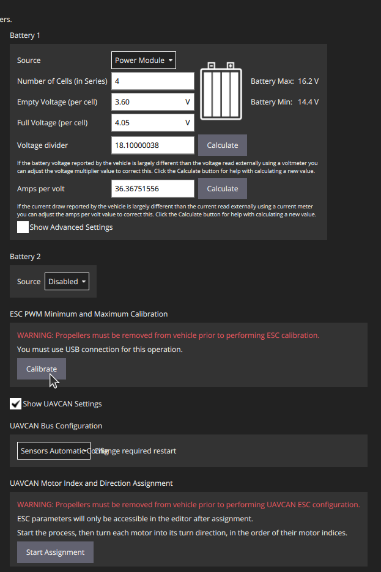
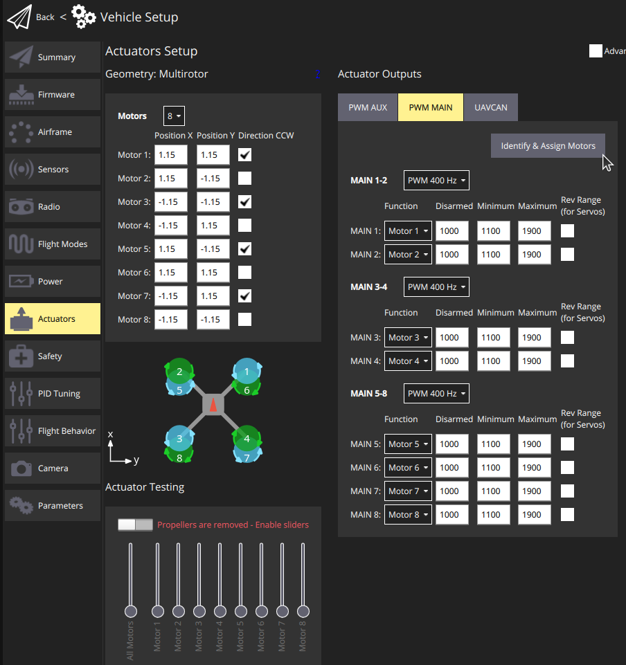

# Mission Planners

<a rel="license" href="http://creativecommons.org/licenses/by/4.0/"></a><br />This work is licensed under a <a rel="license" href="http://creativecommons.org/licenses/by/4.0/">Creative Commons Attribution 4.0 International License</a>.

## What are Ground Control Stations (GCS)?

The Nakoda and Mini-me drone both operated on [Ardupilot's Mission Planner](https://ardupilot.org/planner/docs/mission-planner-overview.html){target=_blank} software as its Ground Control Station (GCS) mission planning software.

GCS are necessary for monitoring on-board information, like remaining battery %, mission plan (survey, waypoints),  

We are testing both Mission Planner and QGroundControl as options for the GCS.

!!! Info "Ground Control Stations (GCS)"

    A ground station is typically run from a ground-based computer, tablet, or phone. It transmits wireless telemetry to teh UAS via an USB antenna.

    * [**Mission Planner**](https://ardupilot.org/planner/docs/mission-planner-overview.html) - Windows friendly, may not be fully Linux compatable.

    

    * [**QGroundControl**](https://qgroundcontrol.com/) - works in Linux, clean, modern look.

    

## Install Mission Planner

Mission Planner is ideally run on a Windows Laptop, but it can also be installed on Android and Linux.

[Mission Planner Installation Instructions](https://ardupilot.org/planner/docs/mission-planner-installation.html){target=_blank}

## Installing QGroundControl 

[Installation Instructions](https://docs.qgroundcontrol.com/master/en/qgc-user-guide/getting_started/download_and_install.html)


### Ubuntu installation

```sh
sudo usermod -a -G dialout $USER
sudo apt-get remove modemmanager -y
sudo apt install gstreamer1.0-plugins-bad gstreamer1.0-libav gstreamer1.0-gl -y
sudo apt install libfuse2 -y
sudo apt install libxcb-xinerama0 libxkbcommon-x11-0 libxcb-cursor-dev -y
```


Install (and run) using the terminal commands:

```sh
mkdir QGroundControl
cd QGroundControl
wget https://d176tv9ibo4jno.cloudfront.net/builds/master/QGroundControl-x86_64.AppImage
```

Download [QGroundControl.AppImage](https://d176tv9ibo4jno.cloudfront.net/builds/master/QGroundControl-x86_64.AppImage){target=_blank}

```sh
chmod +x ./QGroundControl.AppImage
./QGroundControl.AppImage  (or double click)
```

## Loading Firmware
Firmware can be reflashed/updated from the Vehicle Setup > Firmware menu. The [wiki](https://docs.qgroundcontrol.com/master/en/qgc-user-guide/setup_view/firmware.html) has slightly outdated screenshots. 
> QGroundControl may guide you through firmware parameters upon first flash


## Firmware Setup
The following is a list of working parameters for Mini-me:
  
* **Airframe**: Generic 10" Octo 
  
* **Sensors**: Follow calibration steps if asked for by QGroundControl.
* **Radio**: Follow calibration steps as outlined by QGroundControl, requires radio telemetry to be plugged plugged into main board.
  
* **Flight Modes**: Adjust the "mode channel" to reflect which switch on the radio controller you would like to control flight mode.
    - **Switch Settings**: Controls which switch (channel) on the radio controller arms, kills, etc.
* **Power**: Source is "Power Module" with 4 cells. Other values are kept default for now. 
    - You should calibrate ESC's on this screen as well. Make sure the battery is disconnected and the Pixhawk is connected to the  laptop via USB. Press calibrate, then connect the battery when prompted to.
    
* **Actuators**: Identify and assign motors under the "PWM MAIN" menu. The motor will briefly spin and you select the corresponding motor in the graphic to the left. Make sure the battery is connected when doing this.
  

This should provide the bare minimum to control the drone via a remote controller. It's important to note that these steps are not required every time the drone will fly, but rather in case of software malfunction requiring a reset. For more information on firmware setup. the [QGroundControl Wiki](https://docs.qgroundcontrol.com/master/en/qgc-user-guide/setup_view/setup_view.html) provides further details and considerations on firmware setup
## Plan Autonomous Mission

## MAVProxy

[MAVProxy](https://ardupilot.org/mavproxy/)
