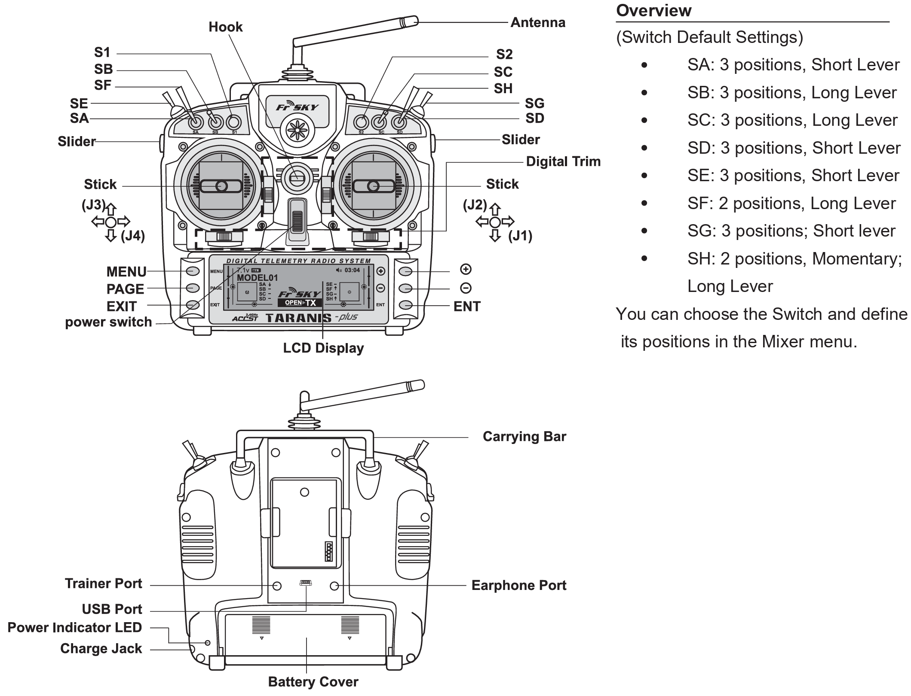

# Remote Control

 This work is licensed under a <a rel="license" href="http://creativecommons.org/licenses/by/4.0/">Creative Commons Attribution 4.0 International License</a>.

We are using a [Taranis Plus RC](https://www.frsky-rc.com/product-category/transmitters/taranis-series/) controller

## Taranis Plus

The Nakoda and Mini-me sUAS can both be operated manually using the Taranis Plus RC.

[Taranis X9D Plus Manual](https://www.frsky-rc.com/wp-content/uploads/Downloads/Manual/X9DP/X9D%20PLUS-manual.pdf){target=_blank}

## pixhawk 4

The brain of the drone, [Pixhawk](https://pixhawk.org/){target=_blank} is the open standard hardware for drones. 

[:simple-github: Pixhawk](https://github.com/pixhawk/){target=_blank}

Image source: [PX4 Pixhawk4 documentation](https://docs.px4.io/main/en/flight_controller/pixhawk4.html)

## PX4

[PX4 Autopilot User Guide](https://docs.px4.io/main/en/)

## Binding Remote Control

