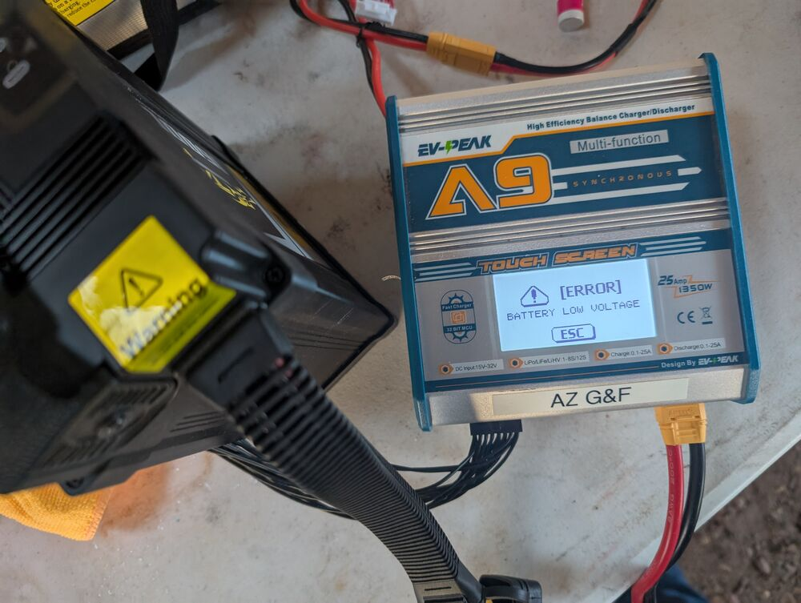
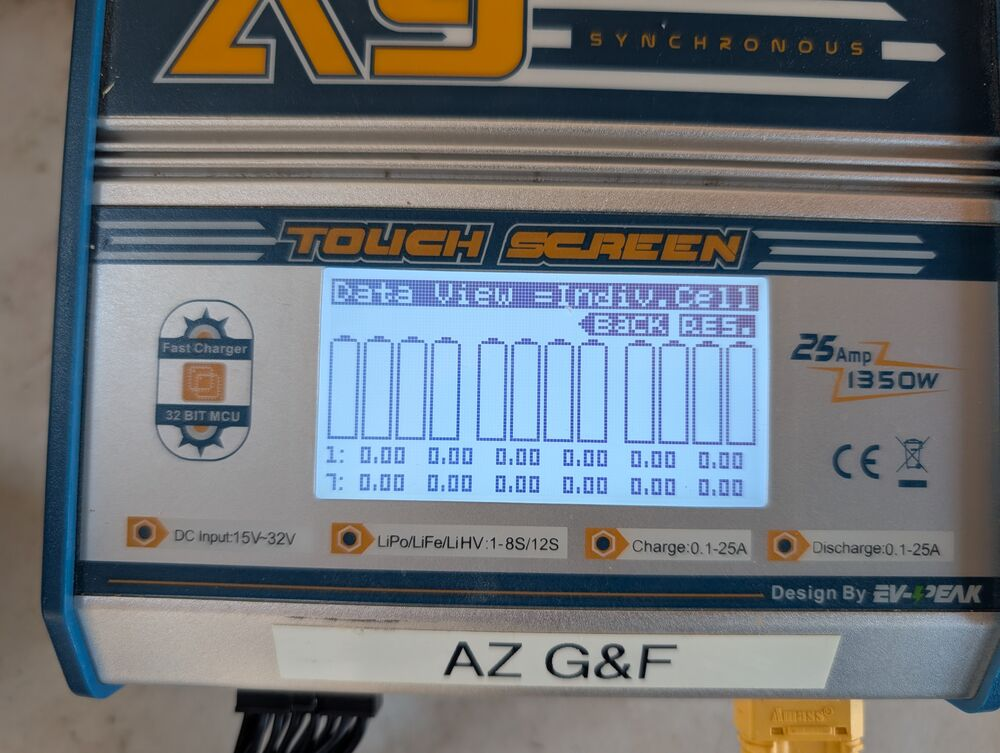
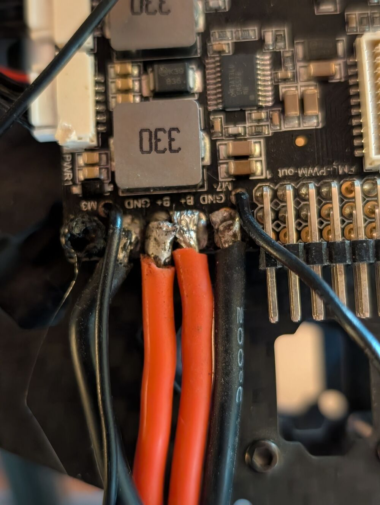
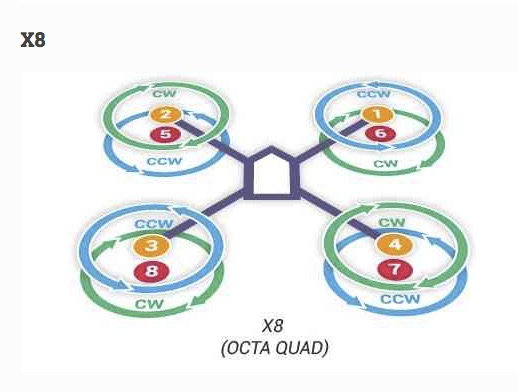
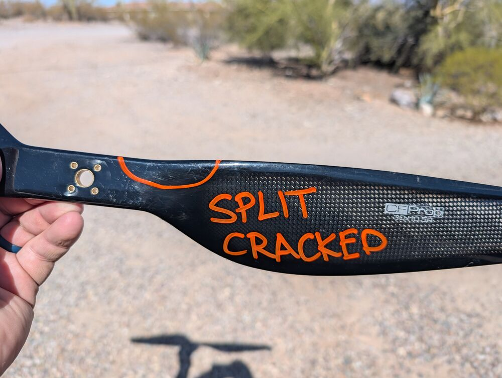
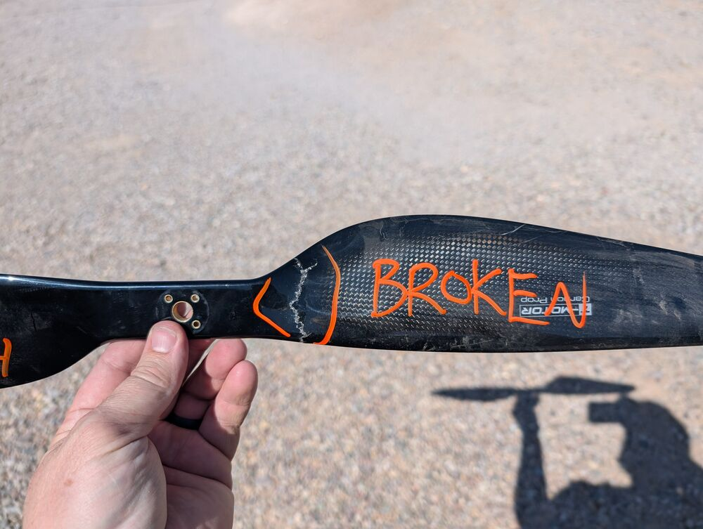

# Repair

 This work is licensed under a <a rel="license" href="http://creativecommons.org/licenses/by/4.0/">Creative Commons Attribution 4.0 International License</a>.

## Cleaning

Dust is the enemy of electric motors and electronics.

All storage bins were washed and dried, spare parts were wiped with a dry microfiber cloth. 

Electronics and motors were blasted with compressed air and wiped with Q-tips or microfiber cloth.

Strongly recommend dust abatement for keeping motors and connections dust free or clean routinely after flights. 

## Inspection

### Batteries

The 16,000 mAh Tattu batteries were allowed to completely discharge over the last few years (they were likely manufactured and purchased in 2019 and last used in 2020). This is not good. LiPo batteries require being put into a "storage" charge mode and cycled every 3-6 months. The prolonged storage of the batteries may have resulted in degredation of the cells.

Because the Tattu batteries were completely discharged, I used the battery charger to 'trickle' charge a couple hundred mAh back into the batteries. I then used the 'balance' option to level the cells.

While doing this, X of the batteries failed to take any charge into their cells. 

I was able to recover X batteries and charged them to 3.7v - 3.8v for 'storage' mode.

Two of the three Floureon 5500 mAh batteries exhibited 'swelling'. 

[Swelling](https://www.pknergy.com/news/why-is-lipo-battery-swollen/) occurs in LiPo batteries when they are left in a fully charged or overcharged state for a long period of time, with age, or prolonged harsh environmental conditions. 

Swollen batteries should not be used in flight, as they are a fire hazard. Strongly recommend disposing of these batteries and buying new ones. 

### Carbon Body

The Carbon body of Nakoda is intact, but I am leary about its design and load bearing strength.

Further, the battery is currently housed above the Pixhawk and PDB. This higher center of gravity may be affecting the flight behavior of the octocopter.

### Carbon Arms

Nakoda is designed to lift heavy weight at its centroid, while all of its thrust is coming from the ends of its arms. This tension results in the arms bending upward and the Hopper swinging like a pendulum beneath it.

### Metal brackets

There are metal brackets which hold the landing gear and antenna

### Wires and soldering points

The soldering of the PDB on Mini-me was concerning, some of the hot and ground wires were nearly soldered together (or were in fact touching). There was melted plastic as well, suggesting arcing had occured.

### Power Distribution Board

I inspected the PDB on the Mini-me drone and found that it had signs of arcing (melted plastic, burns) 

The PDB was replaced on Mini-me with the unopened PX4 PDB board. I soldered removed the cables from the old PDB and soldered them to the new board. I tested the current for all of the connections before connecting the 5500 mAh battery.

### ESCs

When I connected the motors and ESCs to the new PDB board, one of the ESCs (Motor 7) immediately began to smoke. I disconnected and removed the ESC and replaced it.

Wiring for the ESCs was incomplete. 

### Motors

The motors were inspected. 

The wiring for the Motors to the PDB for Ardupilot is:

### Propellers

I inspected all of the Nakoda 30" T-Motor Carbon Fiber (CF) 30 inch 10.5 degree propellers. 

There are both left handed (counter-clockwise) and right handed (clockwise) propellers.

Several of the propellers are damaged. Most have minor damage, which may cause vibration and drag. Several have major damage, and one is broken. I used a paint marker to indicate which props are failing or should not be used. 

 

Important: these props appear to be out of production, and are of limited availability from online retailers, costs are $280 to $335 per pair. 

### Telemetry Radio

There was no telemetry radio delivered by AZGFD. 

The inventory list has a USB Antenna for attaching to a field laptop for the Ground Control Station, but no transmitter for the drone.

I have ordered a new Telemetry radio.

### Remote ID

[Remote ID](remoteid.md) is required as of March 2024.

I have ordered a Remote ID transmitter.