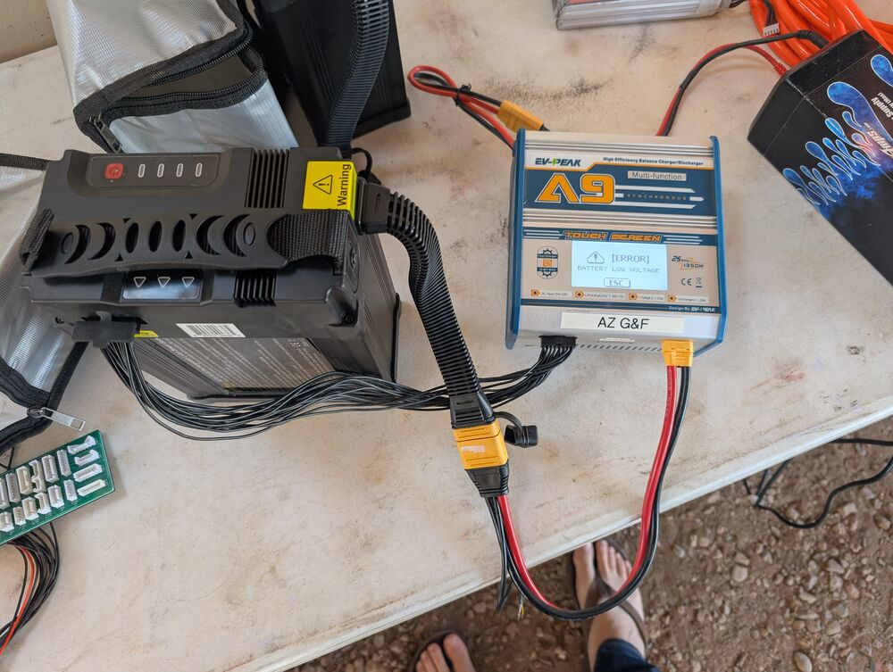
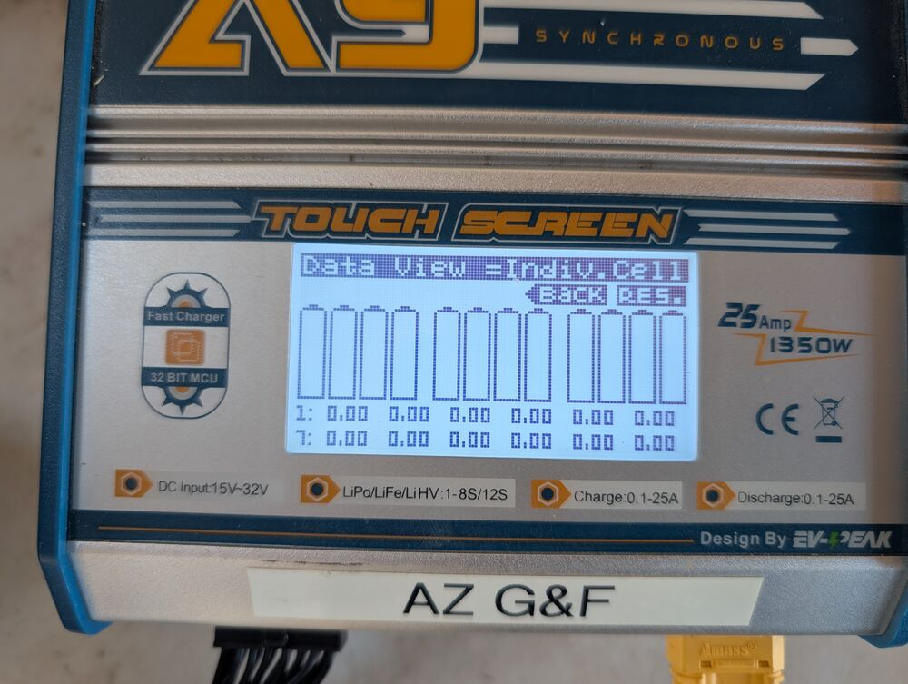
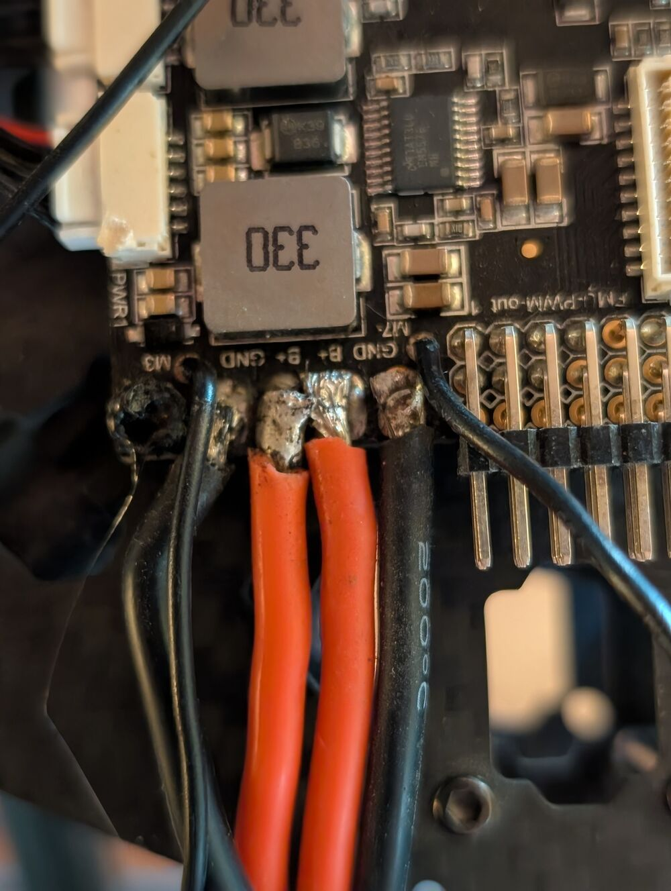

# Triage Report: Nakoda & Mini-me

 This work is licensed under a <a rel="license" href="http://creativecommons.org/licenses/by/4.0/">Creative Commons Attribution 4.0 International License</a>.

This report details the initial inspection and triage findings for the Nakoda and Mini-me drones provided by AZGFD.

## 1. Dust Prevention and Cleaning

Dust poses a significant threat to the longevity and reliability of drone electronics and motors.

**Actions Taken:**

* All storage bins were thoroughly washed and dried.

* Spare parts were carefully wiped clean using dry microfiber cloths.

* Drone electronics and motors were cleaned using compressed air, followed by detailed wiping with Q-tips or microfiber cloths to remove accumulated dust and particulates.

**Recommendations:**

* Implement consistent dust prevention measures for drone storage and transport.

* Routinely clean the drones, especially motors and electrical connections, after flights in dusty environments.

* If transporting drones in exposed areas like a truck bed, consider wrapping sensitive components (motors, ESCs, Flight Controller, PDB) securely in stretch wrap to minimize dust intrusion.

## 2. Equipment Inspection Findings

All equipment delivered by AZGFD underwent a detailed inspection. Key findings are organized by component below.

### 2.1. Batteries

**General LiPo Battery Health:** Lithium Polymer (LiPo) batteries require specific care. They should be stored at a "storage charge" level (around 3.8 volts per cell) and ideally cycled (charged/discharged) every 3-6 months to maintain health. Storing LiPos fully charged or fully discharged for extended periods, especially for years, leads to significant degradation and potential safety hazards like cell failure or swelling. [More on LiPo Swelling](https://www.pknergy.com/news/why-is-lipo-battery-swollen/).

#### 2.1.1. Nakoda Drone Batteries (Tattu 16,000 mAh 12S)

* **Condition Found:** The four Tattu batteries, likely purchased around 2019 and last used in 2020, were found in a fully discharged state after years of inactivity. This storage condition is detrimental to LiPo health.

    
    

* **Recovery Attempt:** Due to the extremely low voltage, a standard charge could not be initiated. A 'trickle' charge was carefully applied to introduce a minimal charge, followed by an attempt to balance the cells.

    
    

* **Outcome:** This recovery procedure was unsuccessful for two batteries, which failed to accept any charge. The remaining two batteries were recovered sufficiently to be brought to a storage charge level (3.7V - 3.8V per cell), but their long-term health and capacity are highly suspect due to the prolonged deep discharge.

    
    

* **Swelling:** While no significant swelling was noted on these specific batteries at this time, the risk increases dramatically with age and improper storage.

    !!! Danger "Swollen Batteries are Unsafe"
        Swollen LiPo batteries indicate internal damage and cell decomposition, posing a significant fire risk. **Never attempt to use or charge a swollen battery.**

* **Recommendation:** **Replace all four Nakoda Tattu batteries** before the drone re-enters service. The combination of age (approx. 5-6 years), prolonged storage in a damaging discharged state, and the failure of two batteries during recovery attempts makes the remaining batteries unreliable and potentially unsafe. Dispose of the old batteries properly at an [appropriate battery recycling facility](https://www.epa.gov/recycle/used-lithium-ion-batteries){target=_blank}. Tattu guidance ([See Manual](https://www.genstattu.com/content/Ordinary.pdf)) suggests cycling batteries every 3 months for optimal health.

#### 2.1.2. Mini-me Drone Batteries (Floureon 5500 mAh 3S)

* **Condition Found:** All three Floureon batteries exhibited problems during testing. Two batteries show moderate physical swelling. The third battery registered internal cell errors and could not be charged.

* **Age:** These batteries are also estimated to be around 5 years old.

* **Availability:** The Floureon brand appears to be discontinued, but numerous suitable alternative 3S batteries with XT60 connectors are available from other manufacturers.

* **Recommendation:** **Replace all three Mini-me Floureon batteries** before the drone re-enters service due to swelling, cell errors, and age. Dispose of the old batteries properly.

### 2.2. Airframe Inspection (Nakoda)

* **Main Body:** The primary carbon fiber structure of the Nakoda drone appears intact.

* **Battery Position:** The Tattu battery housing is located directly above the Pixhawk flight controller and Power Distribution Board (PDB). This high center of gravity might negatively impact flight stability and maneuverability. *Consideration should be given to potentially relocating the battery for improved flight dynamics if feasible.*

* **Arms & Load Stress:** The octocopter design places significant stress on the arms during flight, particularly when lifting heavy payloads. The upward thrust from the motors counteracts the downward pull of the payload, causing observable flex in the arms.

* **FPV Components:** Metal brackets previously used for mounting FPV antennas were present. All FPV equipment has been removed for this operational phase.

### 2.3. Wiring, Soldering, and Power Distribution

* **Mini-me PDB Issues:**

    * Inspection of the Mini-me's original Power Distribution Board (PDB) revealed concerning soldering quality. Several main power connections (positive and negative wires) were soldered extremely close together, potentially touching.

    * Signs of arcing, including melted plastic and burn marks near solder joints, were observed, indicating previous short circuits or near-shorts.

        

    * **Action Taken:** The original Mini-me PDB was deemed unsafe and removed. It was replaced with a new, unused PX4 PDB. All power leads were carefully desoldered from the old board and re-soldered onto the new PDB with proper spacing and insulation. Connections were continuity-tested before applying battery power.

    * **Additional Upgrade:** A new Power Supply Board (PSB), similar to the type used on Nakoda, was also acquired for Mini-me. This type of board simplifies power wiring and reduces the need for high-current soldering directly onto the PDB main pads, potentially improving reliability. *(Installation pending or completed - clarify if needed)*

* **Nakoda Wiring Issues:**

    * One arm of the Nakoda drone was found to be missing its motor power wires connecting the ESC to the PDB.

    * **Action Taken:** New wires and appropriate connectors were ordered and securely soldered to restore power to the affected arm/motor.

### 2.4. Electronic Speed Controllers (ESCs)

* **Mini-me ESC Failure:** Upon connecting battery power after replacing the Mini-me PDB, the ESC connected to Motor 7 immediately began smoking, indicating a critical failure.

* **Action Taken:** The faulty ESC was disconnected and removed. A replacement ESC was installed. A 4-pack of new 30A ESCs (matching the existing type) was ordered to replace the failed unit and provide spares.

### 2.5. Motors

* **Mini-me Motor Wiring:** The standard Ardupilot wiring configuration for an octocopter frame was confirmed:

    

* **Mini-me Motor Failures:** During testing, three of the DJI motors on the Mini-me drone were found to be inoperable (failed to spin or exhibited erratic behavior).

* **Action Taken:** The three failed DJI motors were replaced with the extra motors from the cache box.

### 2.6. Propellers (Nakoda)

* **Type:** Nakoda utilizes 30-inch T-Motor Carbon Fiber (CF) propellers (model 30x10.5). The set includes both clockwise (CW, right-handed) and counter-clockwise (CCW, left-handed) rotating props, which must be installed on the correct motors.

* **Condition Found:** A thorough inspection revealed damage across multiple propellers:
    * Several props exhibit minor edge damage (chips, nicks), which can introduce vibrations and reduce efficiency.
    * Several props have major damage (significant cracks, delamination).
    * One propeller was found completely broken.

    
    

* **Marking:** Damaged propellers were marked with a paint marker to indicate they should not be used ('FAIL' or similar indication).

* **Availability & Cost:** **Important:** These specific T-Motor 30x10.5 propellers appear to be discontinued or have very limited availability from online retailers. Current replacement costs, where available, range from $280 to $335 per pair (one CW, one CCW). Sourcing a full set of replacements may be challenging and expensive.

* **Recommendation:** **Replace all damaged propellers immediately.** Given the difficulty in sourcing exact replacements, investigate suitable alternative propeller options compatible with the Nakoda motors and frame if a full set cannot be acquired. Using damaged propellers is unsafe and drastically affects flight performance.

### 2.7. Telemetry Radio

* **Condition Found:** No telemetry radio transmitter (the component installed *on* the drone) was included in the equipment delivered by AZGFD. Only the USB ground station receiver (for connection to a field laptop) was present according to the inventory list.

* **Action Taken:** A new, compatible telemetry radio system (transmitter and receiver pair) has been ordered.

### 2.8. Remote ID Compliance

* **Requirement:** FAA regulations mandate Remote ID broadcast capabilities for drones of this category operating in US airspace, effective since March 16, 2024. ([See Remote ID details](remoteid.md)).

* **Action Taken:** A suitable Remote ID transmitter module has been ordered for installation on the drones.